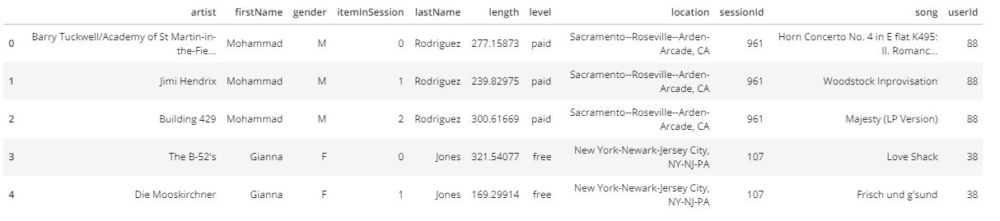

# Project: Data Modelling with Apache Cassandra
> Project 2 of Udacity Data Engineering Nanodegree

## Introduction
A startup called Sparkify wants to analyze the data they've been collecting on songs and user activity on their new music streaming app. The analysis team is particularly interested in understanding what songs users are listening to. Currently, there is no easy way to query the data to generate the results, since the data reside in a directory of CSV files on user activity on the app.

They'd like a data engineer to create an Apache Cassandra database which can create queries on song play data to answer the questions, and wish to bring you on the project. Your role is to create a database for this analysis. You'll be able to test your database by running queries given to you by the analytics team from Sparkify to create the results.

## Project Description
This project presents an ETL pipeline using Python to extract user activity data on the startup music app, Sparkify. The data resides in a directory of CSV files, which are being loaded to an Apache Cassandra keyspace, sparkifyks. The data is modelled to answer the queries below;

1. get the artist, song title and song's length in the music app history that was heard during sessionId = 338, and itemInSession = 4
2. get the name of artist, song (sorted by itemInSession) and user (first and last name) for userid = 10, sessionid = 182
3. get every user name (first and last) in the music app history who listened to the song 'All Hands Against His Own'

In Cassandra, every table represents a query, therefore the data is modelled into 3 tables to help answer the above queries.

## Project Datasets - Event Data
The dataset resides in a directory of CSV files partitioned by date as shown below
```
event_data/2018-11-08-events.csv
event_data/2018-11-09-events.csv
```
Below is a screenshot of the first 5 rows of the data



## Project Files
The project is sectioned into 3 files as described below;
1. `all_event_datafiles.csv`: CSV file containing all the data in the directory of csv files.
2. `Project_1B_ Data_Modelling_with_Apache_Cassandra.ipynb`: Jupyter notebook that processes the **all_event_datafiles.csv** file to create a denormalized dataset.
3. `README.md`: Provides details and summary of the project.

## ETL Process
ETL (Extract, Transform, Load) is general process that takes raw data from one or more sources, extracts the information required for analysis, transforms the data into a format that can serve business needs, and loads the data to a data warehouse or final destination. This process is usually automated via an ETL pipeline.

### ETL Pipeline
The ETL pipeline extracts copies of the date-partitioned csv files into a single csv file, `all_event_datafiles.csv`, which is used to create the denormalized Cassandra tables. As started earlier, the queries need to be kept in mind whilst modelling the tables. The tables modelled to answer the above queries respectively are;
1. `artist_song_detail_by_session_and_item`: returns artist, song title and song's length for a given sessionId and itemInSession.
2. `user_detail_by_session`: returns name of artist, song (sorted by itemInSession) and user (first and last name) for a given userid and sessionid.
3. `user_detail_by_song`: returns every user name (first and last) who listened to a given song.

The pipeline also defines a function to convert the returned query results into Pandas dataframe for better presentation of the returned query results.

### Running the Jupyter
With Apache Cassandra installed, simply load and run the jupyter notebook, "**Project_1B_ Data_Modelling_with_Apache_Cassandra.ipynb**".
